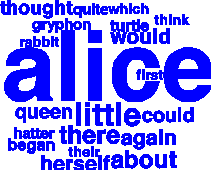

## Twitter Tag Cloud

#### What is Twitter Tag Cloud?
  This is an application that gets the most used hashtags in Twitter for some time period using Apache Spark and produces a tag cloud from them.

##### Tag cloud example from twitter


##### Offline tag cloud


#### Prerequisites
*   You should have    [sbt](http://www.scala-sbt.org/0.13/docs/Setup.html) installed.
* In order to authenticate to the Twitter API you should have a twitter4j.properties file in the root of this repo. It structure should be the following:

  ```
  debug=true
  oauth.consumerKey=***
  oauth.consumerSecret=***
  oauth.accessToken=***
  oauth.accessTokenSecret=***

  ```

  You could find more information on how to generate those [here](https://dev.twitter.com/oauth/overview/application-owner-access-tokens).

#### Setup
* Run the following commands in the terminal:

  ```
  sbt compile && sbt run 2> /dev/null
  ```

Developed by Daniel Taskoff and Julia Nedialkova.
